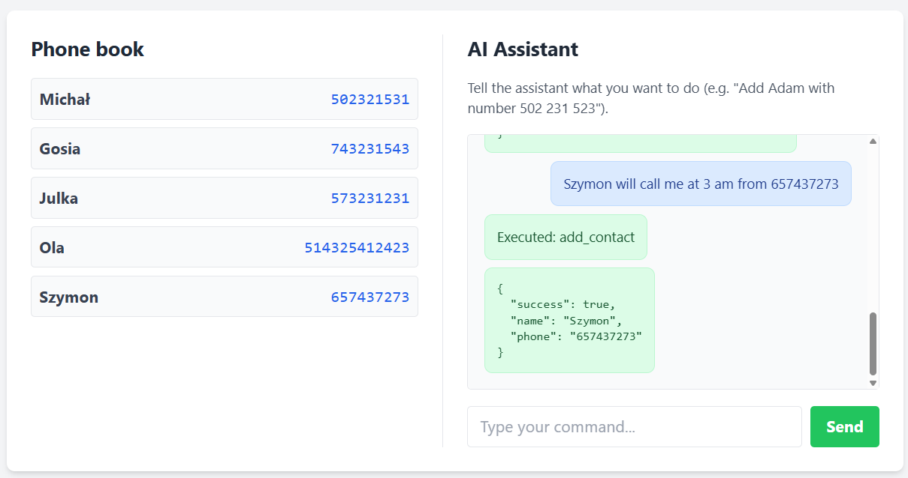
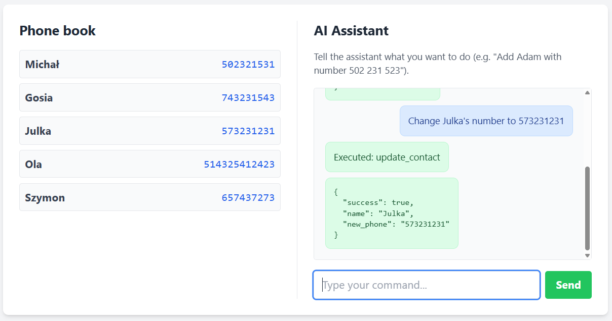
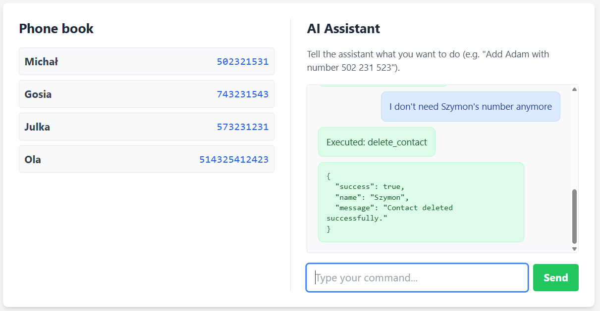

# SP Global Task - FastApi & llama-3.3-70b

Currently hosted [here](http://63.177.54.100:8000/).

A web app with implemented phone book fully operated by AI assistant.
Integrated chat allows user to type wanted activities and based on the prompt
chat decide what CRUD operation to perform


## Screenshots

Here is a preview of the main operations within the app:


*Adding contact.*


*Updating contact's number.*


*Deleting contact.*



## How to run locally

### 1. Run docker container
The easiest way to run this application is by using Docker. You don't need to install any system dependencies other than the Docker engine. However you need to create GROQ API KEY to be able to use AI chat.

```bash
docker run -p 8000:8000 -e GROQ_API_KEY="your_api_key_here" matiwanda/sp-global-task
```


### 2. Clone the repository
Second way is to just git clone the repository. Here you also need to generate GROQ API KEY.
```bash

git clone https://github.com/Ralfmat/sp-global-task.git
cd sp-global-task
pip install -r requirements.txt
uvicorn main:app